# AITE HOUSE — Cahier de recette (UAT)

**Suite hôtelière AITE HOUSE sur Odoo 18 — recette applicative**
Généré le 2026-09-15 11:23 · instance recettée : `http://127.0.0.1:8069`

---

## Comment lire ce cahier

Chaque scénario correspond à **un poste de travail** et se joue avec le
profil utilisateur de ce poste — pas avec un compte administrateur. Les
captures d'écran sont celles obtenues lors de l'exécution : ce que le
document montre est ce que l'utilisateur voit.

Pour chaque étape :

| Colonne | Contenu |
|---|---|
| **Action** | Le geste effectué, dans l'ordre |
| **Attendu** | Le comportement exigé par la spécification |
| **Constaté** | Ce que l'écran a réellement produit |
| **Verdict** | ✅ conforme · ❌ écart |

### Comptes de recette

Les profils sont créés par le module `aite_demo_data`. Le mot de passe
est identique à l'identifiant (**base de démonstration uniquement**).

| Poste | Identifiant | Périmètre |
|---|---|---|
| Réception | `demo.reception` | Réservations, folios, encaissements, check-in / check-out |
| Gouvernante | `demo.gouvernante` | Tâches de ménage et états de chambre |
| Caisse | `demo.caisse` | Point de vente, ardoises, remboursements |
| Magasin | `demo.magasin` | Stock, inventaires, alertes |
| Direction | `demo.direction` | Tous les tableaux de bord, configuration |

### Rejouer la recette

```bash
python tests_uat/run_uat.py --url http://mon-serveur:8069
python tests_uat/build_guide.py
```

---

## Synthèse

| Scénario | Poste | Étapes | Verdict |
|---|---|---|---|
| [La journée de la réception](#1-la-journée-de-la-réception) | Réception (Awa Diallo) | 7 | ✅ Conforme |
| [Le tour des chambres](#2-le-tour-des-chambres) | Gouvernante (Fanta Souaré) | 5 | ✅ Conforme |
| [Ardoises clients et recouvrement](#3-ardoises-clients-et-recouvrement) | Caisse (Ibrahima Sylla) | 7 | ✅ Conforme |
| [Le cockpit de la direction](#4-le-cockpit-de-la-direction) | Direction (Aminata Bah) | 7 | ✅ Conforme |
| [La réservation en ligne](#5-la-réservation-en-ligne) | Client (visiteur du site) | 6 | ✅ Conforme |
| [Stock, ruptures et réapprovisionnement](#6-stock,-ruptures-et-réapprovisionnement) | Magasin (Moussa Camara) | 2 | ✅ Conforme |

**Total : 34 étapes — 0 écart(s) constaté(s).**

---

## 1. La journée de la réception

> **Poste :** Réception (Awa Diallo)
> **Objectif :** Prendre connaissance de la journée, retrouver une réservation, ouvrir un folio et encaisser un acompte.
> **Verdict global :** ✅ Conforme


### 1. Ouvrir le Front Desk

| | |
|---|---|
| **Attendu** | Le tableau de bord affiche l'occupation du jour, les arrivées, les départs et le room board. |
| **Constaté** | Occupation, arrivées, départs et room board sont affichés. |
| **Verdict** | ✅ Conforme |

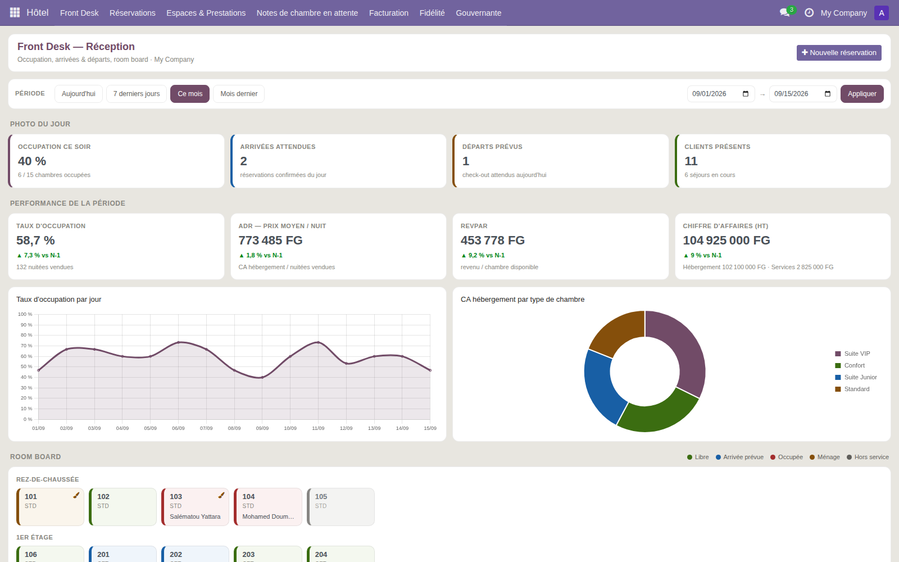


### 2. Consulter les arrivées du jour

| | |
|---|---|
| **Attendu** | La liste ne montre que les réservations confirmées arrivant aujourd'hui. |
| **Constaté** | La liste des arrivées du jour s'affiche. |
| **Verdict** | ✅ Conforme |

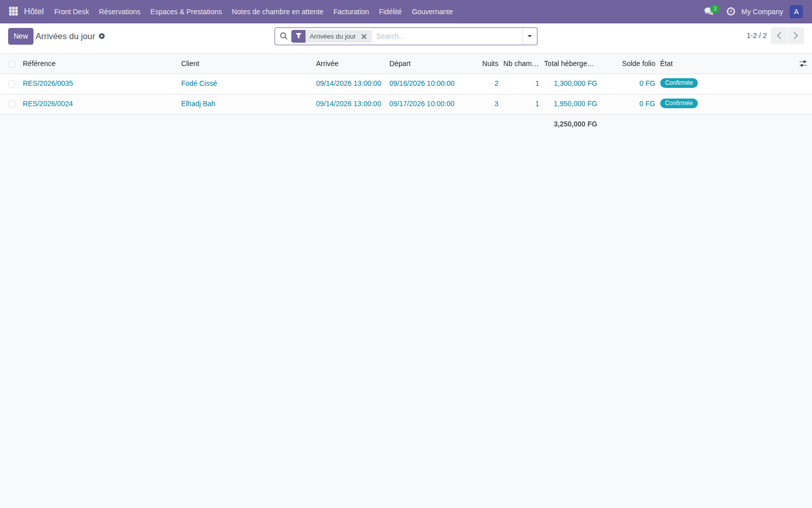


### 3. Ouvrir le planning des chambres

| | |
|---|---|
| **Attendu** | Le planning s'affiche — calendrier sur Community, Gantt sur Enterprise — avec les séjours de la période. |
| **Constaté** | Le planning s'ouvre et présente les séjours. |
| **Verdict** | ✅ Conforme |

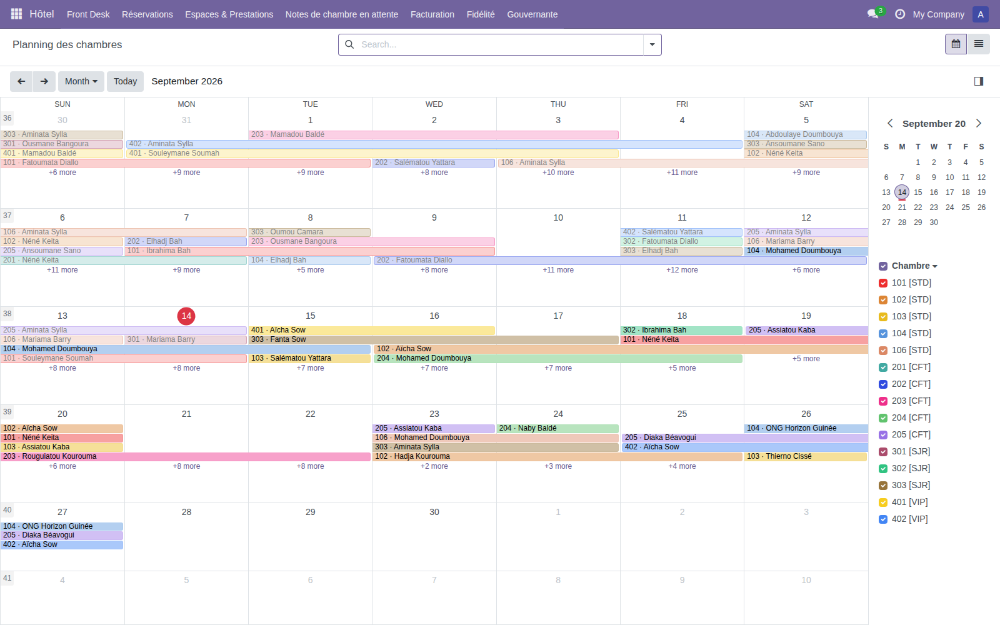


### 4. Lister les réservations

| | |
|---|---|
| **Attendu** | La liste des réservations du séjour s'affiche. |
| **Constaté** | La liste des réservations du séjour s'affiche. |
| **Verdict** | ✅ Conforme |

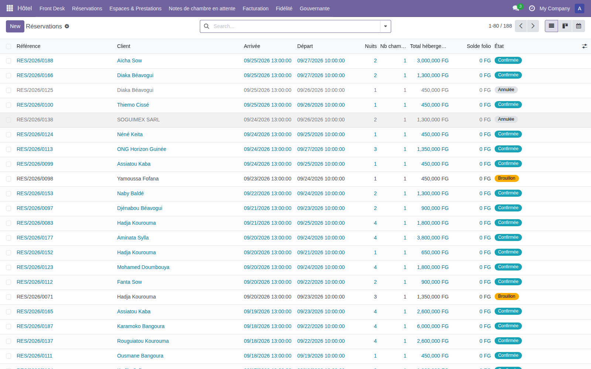


### 5. Ouvrir une réservation

| | |
|---|---|
| **Attendu** | La fiche montre le client, les chambres, le folio et les boutons du workflow. |
| **Constaté** | La fiche réservation s'ouvre avec son folio. |
| **Verdict** | ✅ Conforme |

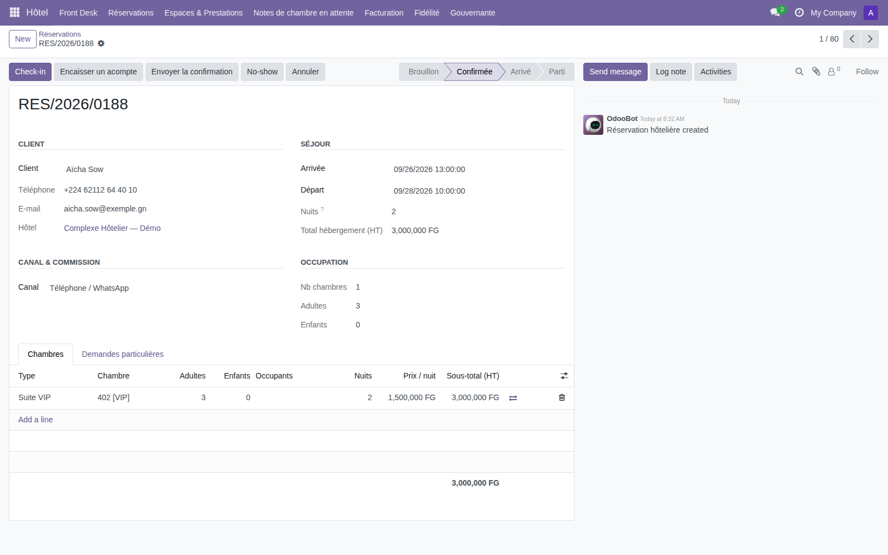


### 6. Consulter les folios

| | |
|---|---|
| **Attendu** | Les notes de séjour listent hébergement, services et solde dû. |
| **Constaté** | Les folios s'affichent avec leur solde. |
| **Verdict** | ✅ Conforme |

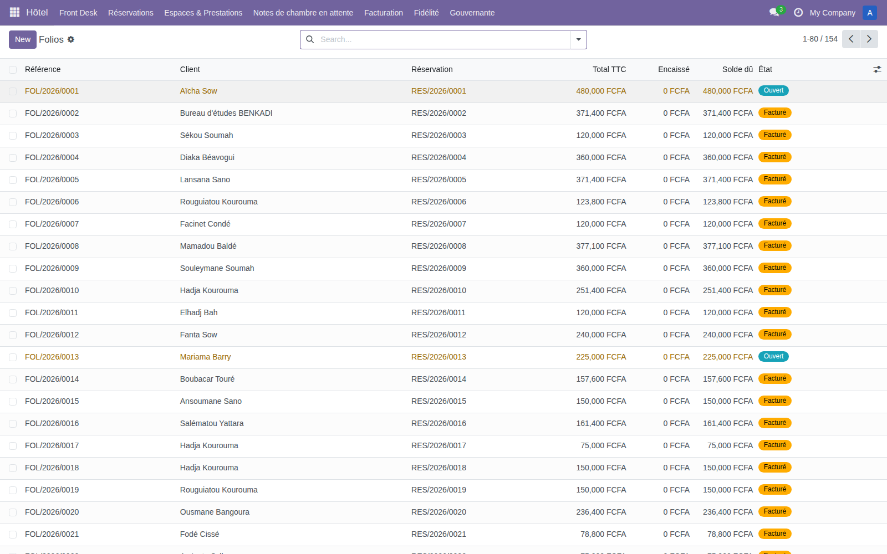


### 7. Ouvrir la réservation rapide

| | |
|---|---|
| **Attendu** | L'assistant propose dates, occupation et recherche de disponibilité. |
| **Constaté** | L'assistant de réservation rapide s'ouvre. |
| **Verdict** | ✅ Conforme |

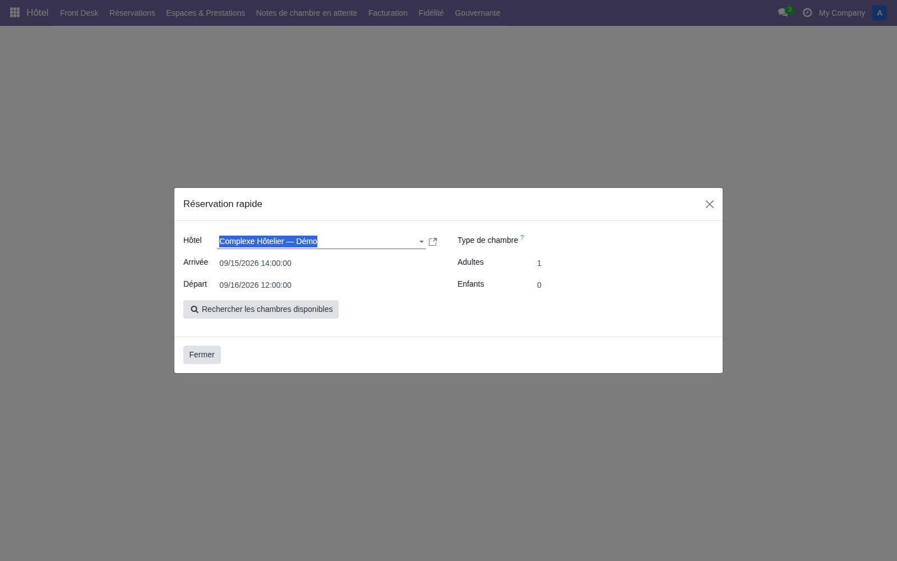


---

## 2. Le tour des chambres

> **Poste :** Gouvernante (Fanta Souaré)
> **Objectif :** Prendre ses tâches du jour, démarrer une recouche, la terminer et voir l'état des chambres changer.
> **Verdict global :** ✅ Conforme


### 1. Ouvrir les tâches de gouvernante

| | |
|---|---|
| **Attendu** | Les tâches du jour s'affichent, groupées par état. |
| **Constaté** | Les tâches de ménage du jour sont listées. |
| **Verdict** | ✅ Conforme |

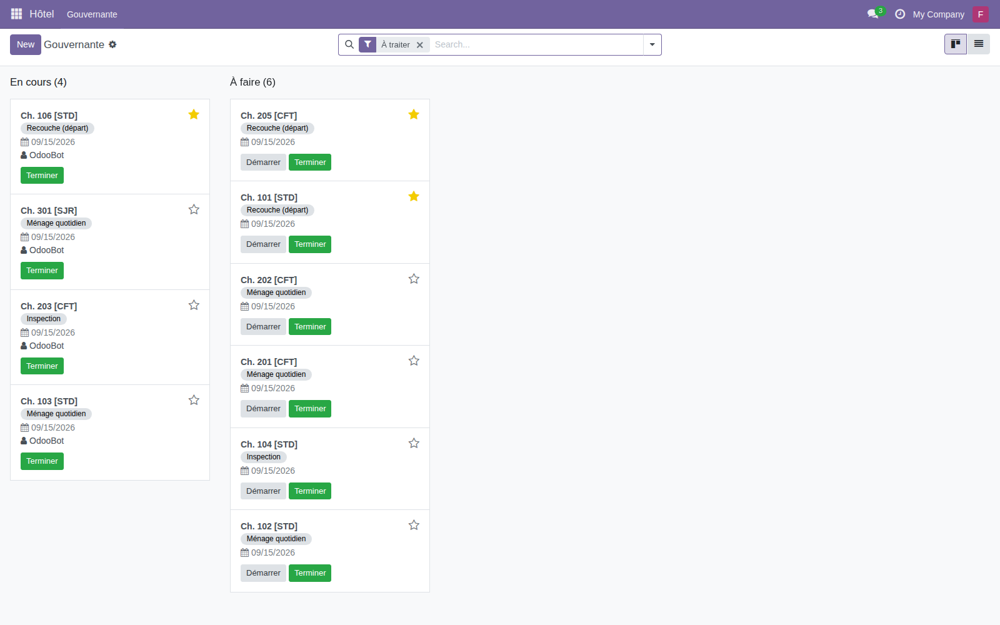


### 2. Démarrer une recouche depuis le kanban

| | |
|---|---|
| **Attendu** | La carte bascule dans la colonne « En cours » et la chambre passe en « Nettoyage en cours ». |
| **Constaté** | La tâche est démarrée : elle quitte la colonne « À faire ». |
| **Verdict** | ✅ Conforme |

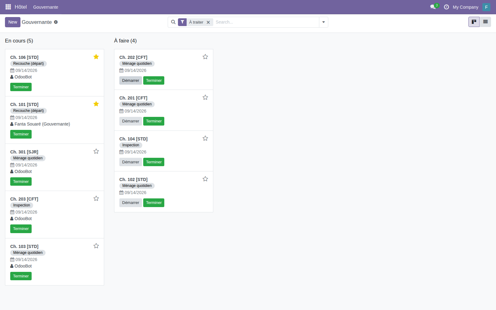


### 3. Terminer la tâche

| | |
|---|---|
| **Attendu** | La tâche passe « Terminé » et la chambre redevient propre (ou « à inspecter » si l'inspection est exigée). |
| **Constaté** | La tâche est clôturée, la chambre est rendue au service. |
| **Verdict** | ✅ Conforme |

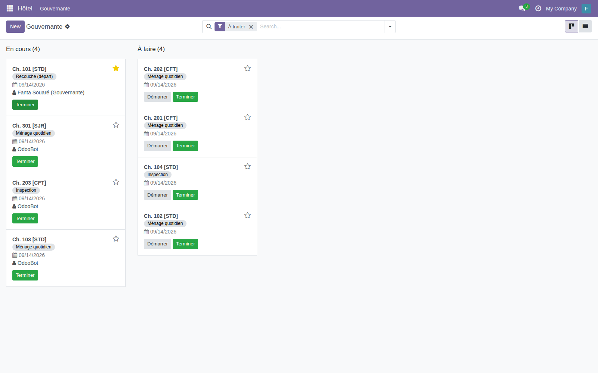


### 4. Consulter les chambres

| | |
|---|---|
| **Attendu** | La gouvernante voit l'état de chaque chambre, mais ni le tarif spécifique ni le tarif du jour : ces données relèvent de la Réception. |
| **Constaté** | Les chambres s'affichent sans aucune donnée tarifaire. |
| **Verdict** | ✅ Conforme |

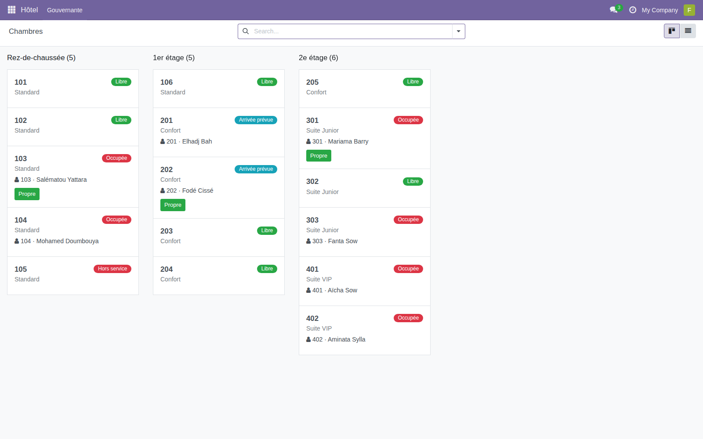


### 5. Tenter d'ouvrir les folios

| | |
|---|---|
| **Attendu** | Le profil Gouvernante n'a pas accès aux notes de séjour : Odoo doit afficher un refus nommant le modèle concerné. |
| **Constaté** | L'accès aux folios est refusé, avec le motif affiché. |
| **Verdict** | ✅ Conforme |

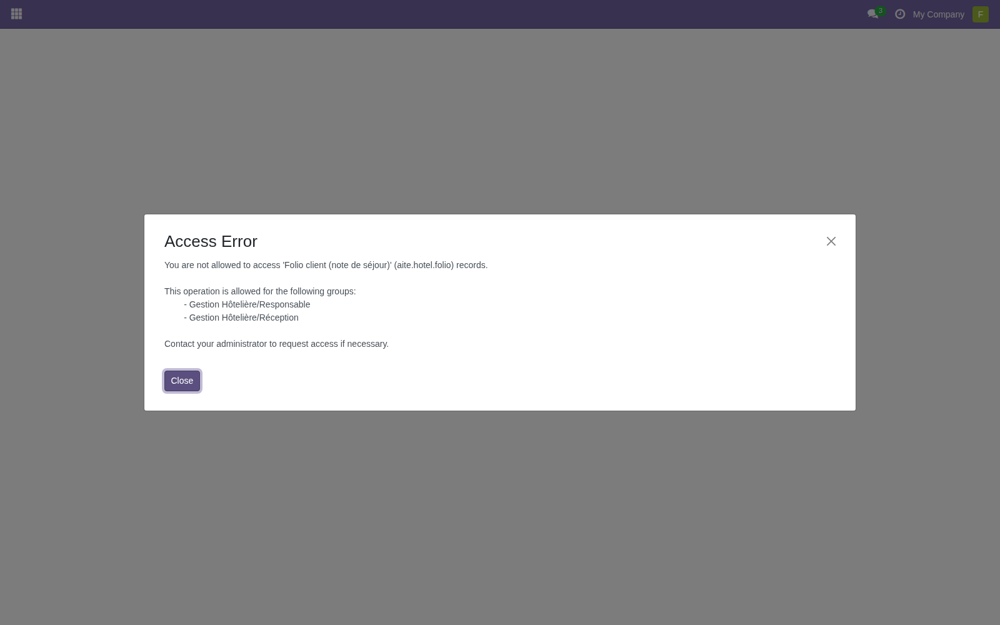


---

## 3. Ardoises clients et recouvrement

> **Poste :** Caisse (Ibrahima Sylla)
> **Objectif :** Suivre l'encours, ouvrir une ardoise, enregistrer un remboursement et vérifier le solde.
> **Verdict global :** ✅ Conforme


### 1. Ouvrir le tableau de bord Recouvrement

| | |
|---|---|
| **Attendu** | Encours total, balance âgée et top débiteurs sont affichés. |
| **Constaté** | Le tableau de bord du recouvrement s'affiche. |
| **Verdict** | ✅ Conforme |

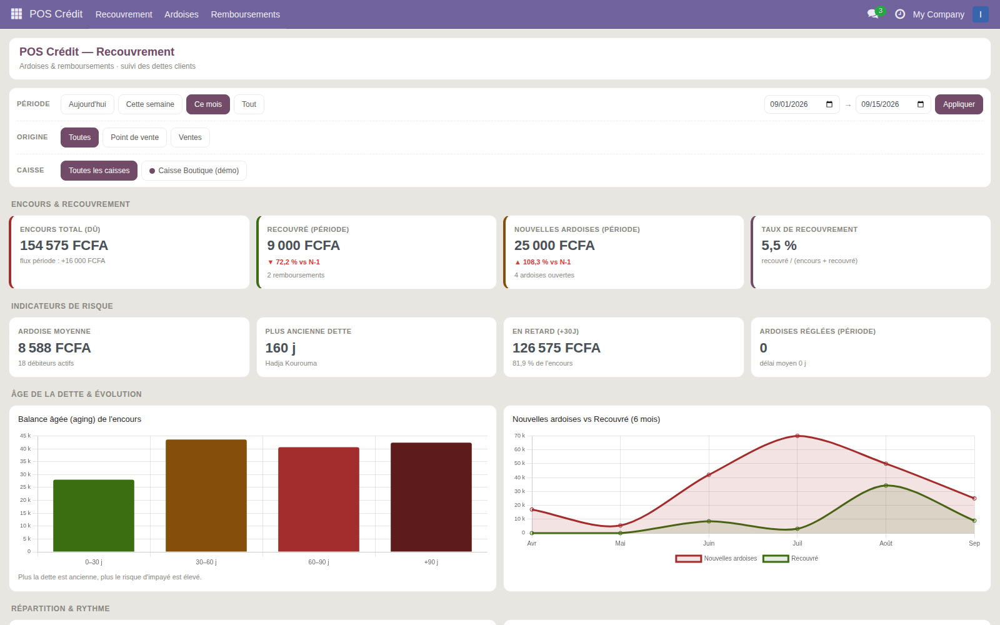


### 2. Lister les ardoises

| | |
|---|---|
| **Attendu** | Les ardoises s'affichent avec client, montant, reste dû et ancienneté. |
| **Constaté** | Les ardoises sont listées avec leur reste dû. |
| **Verdict** | ✅ Conforme |

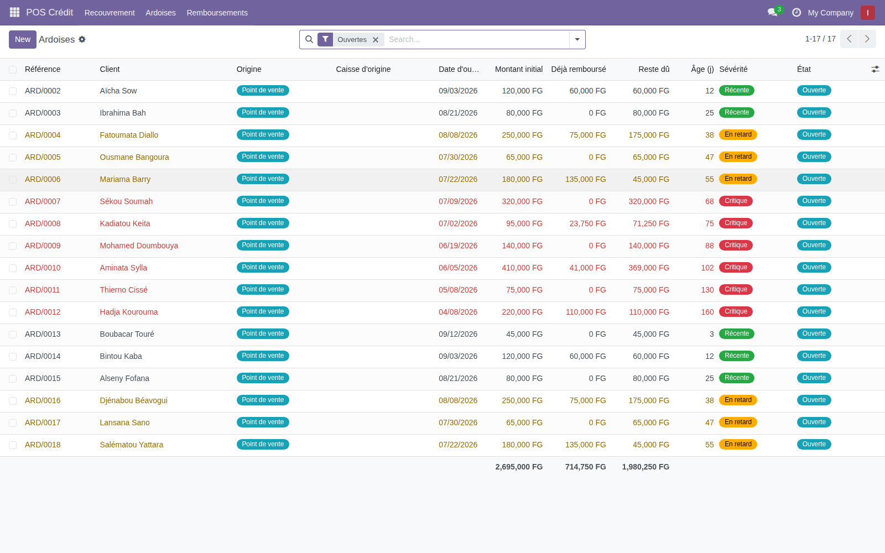


### 3. Filtrer les ardoises ouvertes

| | |
|---|---|
| **Attendu** | Seules les ardoises encore dues restent affichées. |
| **Constaté** | Seules les ardoises encore dues restent affichées. |
| **Verdict** | ✅ Conforme |

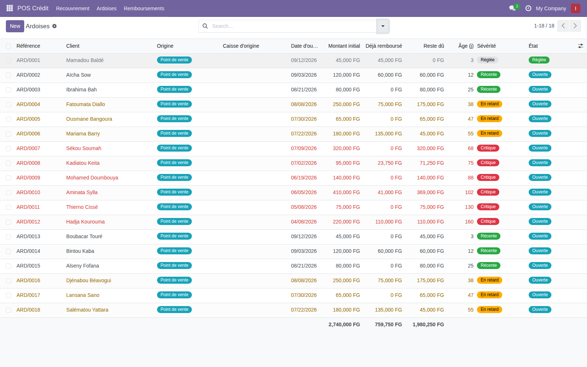


### 4. Ouvrir une ardoise

| | |
|---|---|
| **Attendu** | La fiche montre le reste dû et le bouton « Enregistrer un remboursement ». |
| **Constaté** | La fiche montre le reste dû et le bouton « Enregistrer un remboursement ». |
| **Verdict** | ✅ Conforme |

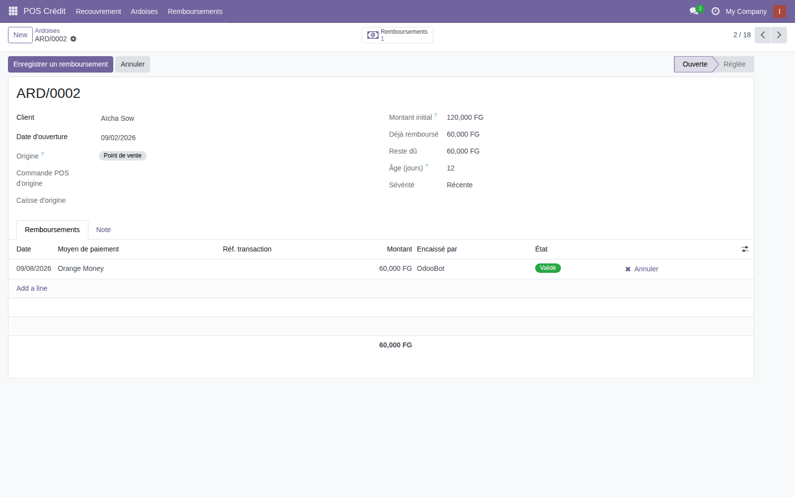


### 5. Assistant de remboursement

| | |
|---|---|
| **Attendu** | Le montant est pré-rempli avec le reste dû et le moyen de paiement est proposé. |
| **Constaté** | Le montant est pré-rempli avec le reste dû et le moyen de paiement est proposé. |
| **Verdict** | ✅ Conforme |

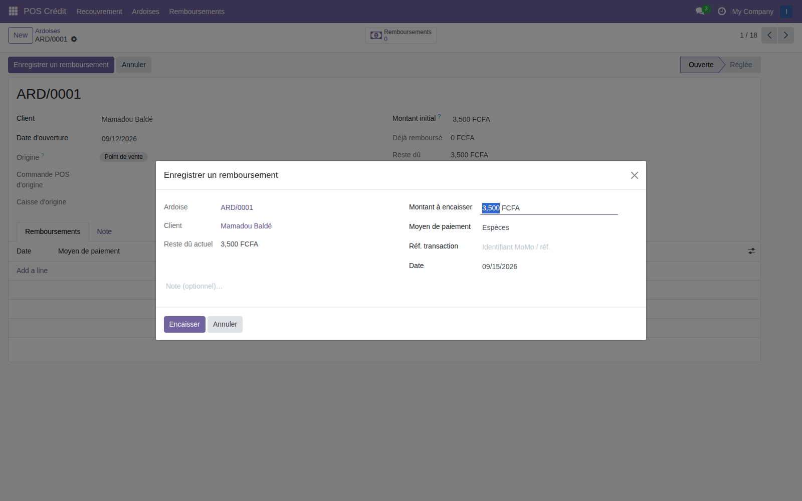


### 6. Enregistrer le remboursement

| | |
|---|---|
| **Attendu** | Le reste dû tombe à zéro et l'ardoise passe « Réglée ». |
| **Constaté** | Le remboursement est enregistré : l'ardoise est soldée. |
| **Verdict** | ✅ Conforme |

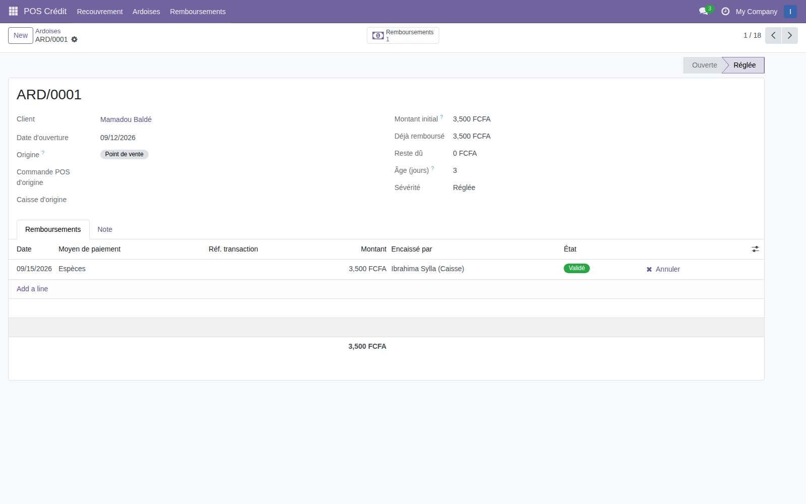


### 7. Tenter d'ouvrir les réservations hôtel

| | |
|---|---|
| **Attendu** | Le profil Caisse n'a pas de droits hôteliers : Odoo doit afficher un refus nommant le modèle concerné. |
| **Constaté** | L'accès au PMS est refusé, avec le motif affiché. |
| **Verdict** | ✅ Conforme |

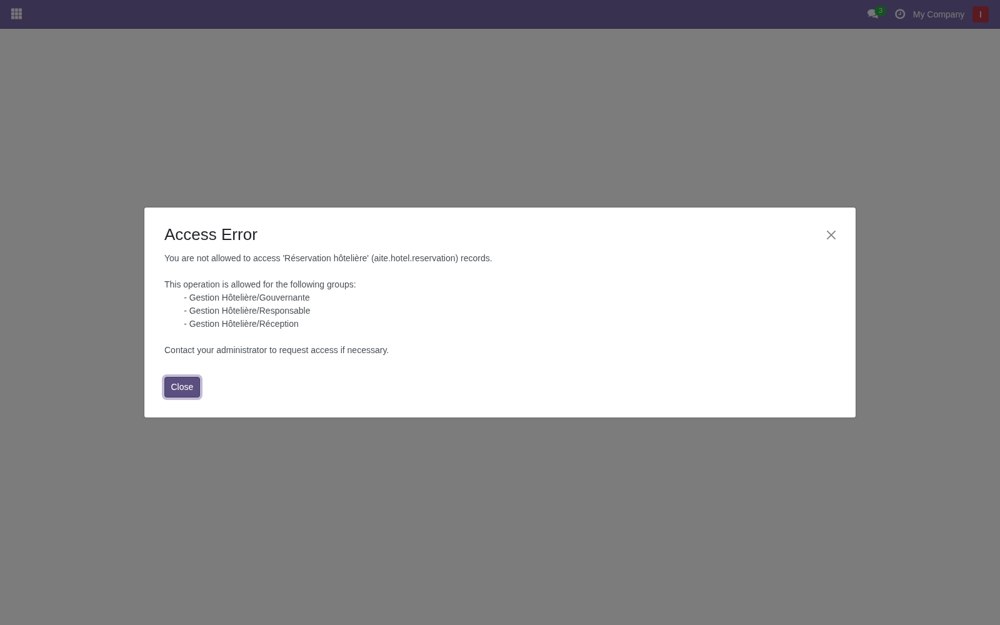


---

## 4. Le cockpit de la direction

> **Poste :** Direction (Aminata Bah)
> **Objectif :** Consulter les tableaux de bord consolidés et vérifier que les chiffres concordent entre les vues.
> **Verdict global :** ✅ Conforme


### 1. Ouvrir — Ventes (POS Analytics)

| | |
|---|---|
| **Attendu** | Chiffre d'affaires, marge, CMV et panier moyen sont affichés. |
| **Constaté** | Le tableau de bord s'affiche et présente ses indicateurs. |
| **Verdict** | ✅ Conforme |

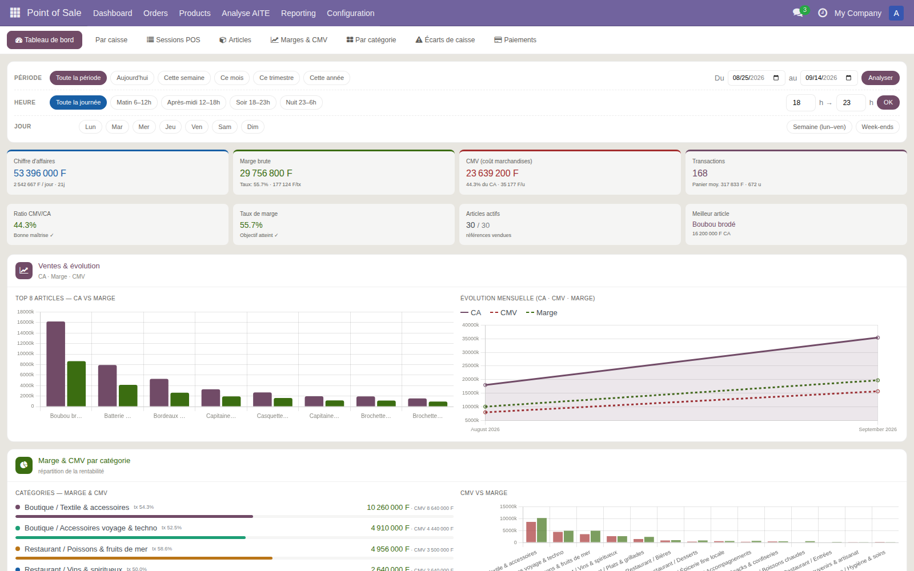


### 2. Ouvrir — Recouvrement (Crédit clients)

| | |
|---|---|
| **Attendu** | Encours, balance âgée et débiteurs à relancer sont affichés. |
| **Constaté** | Le tableau de bord s'affiche et présente ses indicateurs. |
| **Verdict** | ✅ Conforme |


### 3. Ouvrir — Stock & Inventaire

| | |
|---|---|
| **Attendu** | Valorisation, ruptures, couverture et alertes sont affichées. |
| **Constaté** | Le tableau de bord s'affiche et présente ses indicateurs. |
| **Verdict** | ✅ Conforme |

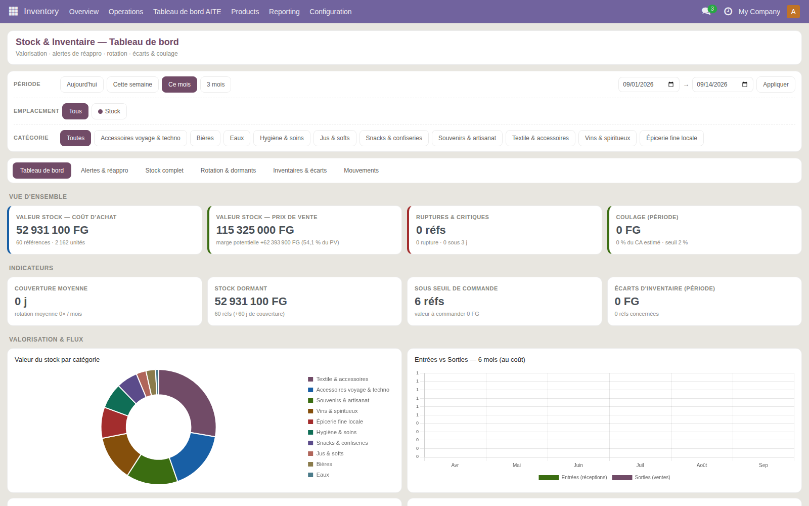


### 4. Ouvrir — Achats & Fournisseurs

| | |
|---|---|
| **Attendu** | Échéancier fournisseurs et évolution des prix sont affichés. |
| **Constaté** | Le tableau de bord s'affiche et présente ses indicateurs. |
| **Verdict** | ✅ Conforme |

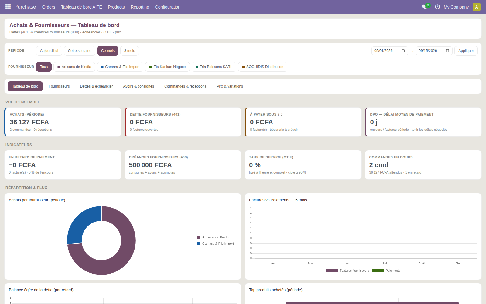


### 5. Ouvrir — Espaces & Prestations

| | |
|---|---|
| **Attendu** | Taux d'occupation des espaces et planning du jour s'affichent. |
| **Constaté** | Le tableau de bord s'affiche et présente ses indicateurs. |
| **Verdict** | ✅ Conforme |

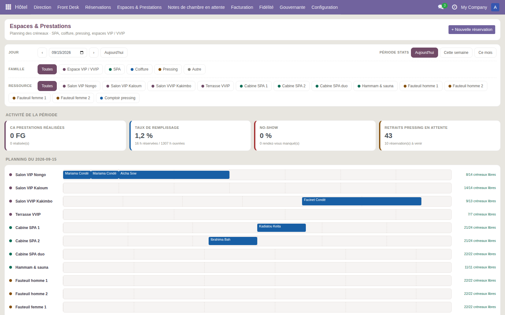


### 6. Ouvrir — Cockpit Direction

| | |
|---|---|
| **Attendu** | La vue consolidée reprend les quatre pôles et la balance âgée en miroir. |
| **Constaté** | Le tableau de bord s'affiche et présente ses indicateurs. |
| **Verdict** | ✅ Conforme |

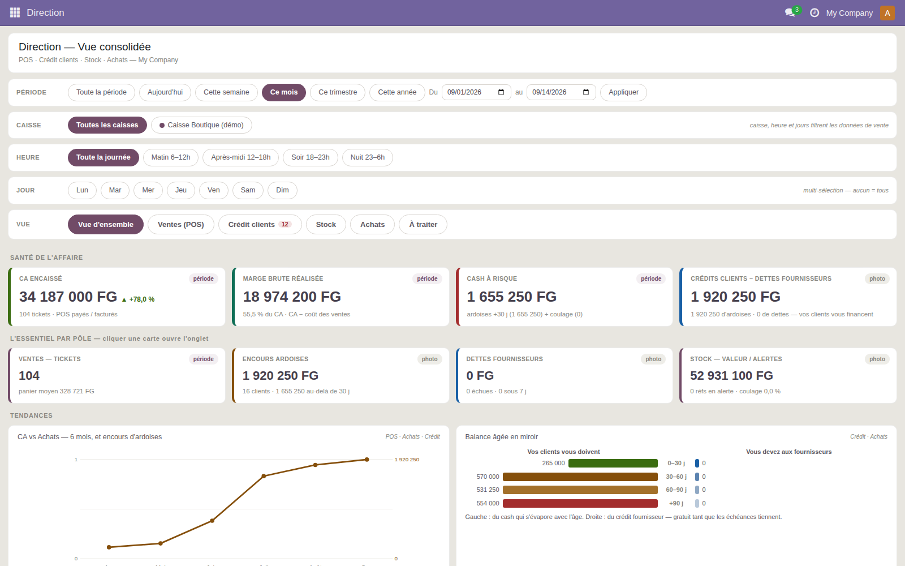


### 7. Ouvrir — Tableau de bord exécutif

| | |
|---|---|
| **Attendu** | Hébergement, restauration et prestations sont consolidés. |
| **Constaté** | Le tableau de bord s'affiche et présente ses indicateurs. |
| **Verdict** | ✅ Conforme |

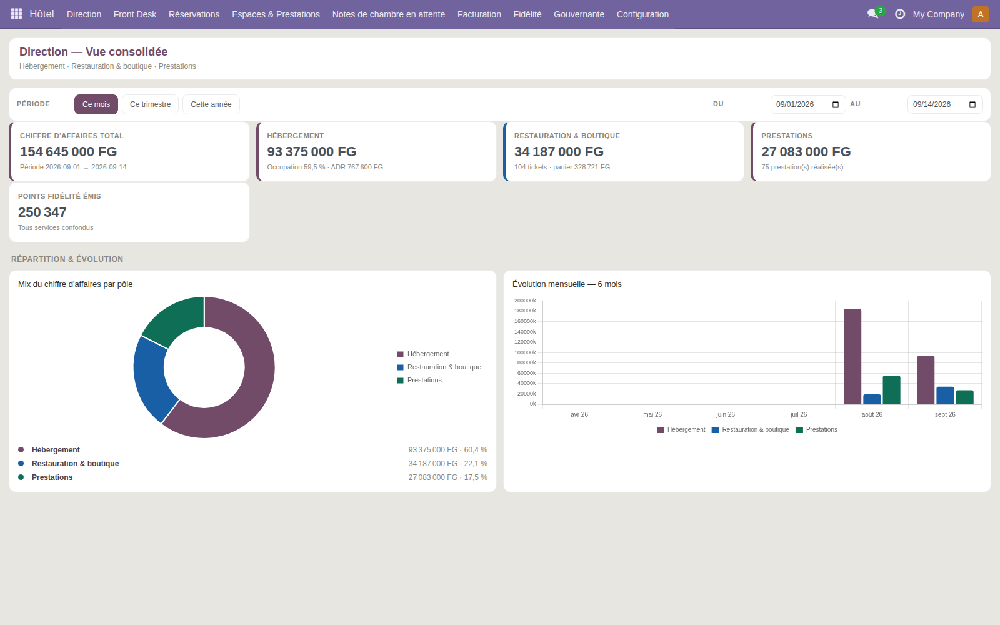


---

## 5. La réservation en ligne

> **Poste :** Client (visiteur du site)
> **Objectif :** Réserver un espace depuis le site public, sans compte, et recevoir la confirmation.
> **Verdict global :** ✅ Conforme


### 1. Ouvrir la page de réservation

| | |
|---|---|
| **Attendu** | La page publique s'affiche sans authentification. |
| **Constaté** | La page de réservation est accessible au public. |
| **Verdict** | ✅ Conforme |

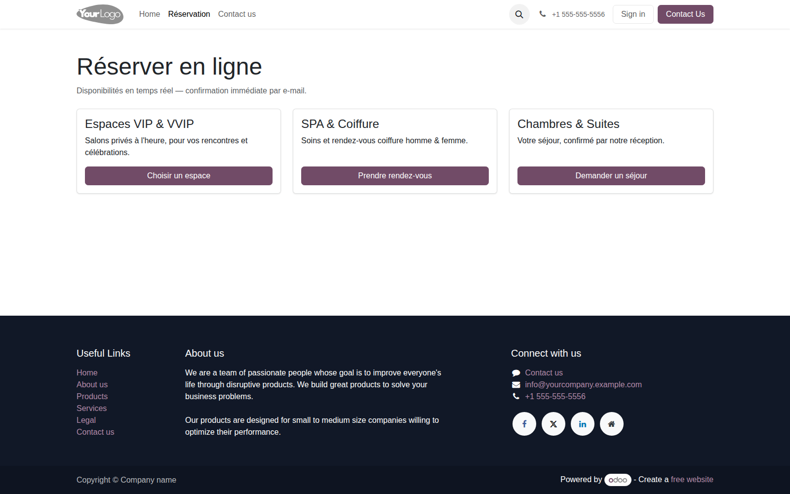


### 2. Choisir un espace

| | |
|---|---|
| **Attendu** | Les espaces réservables en ligne sont listés ; ceux réservés au comptoir n'apparaissent pas. |
| **Constaté** | La liste des espaces réservables s'affiche. |
| **Verdict** | ✅ Conforme |

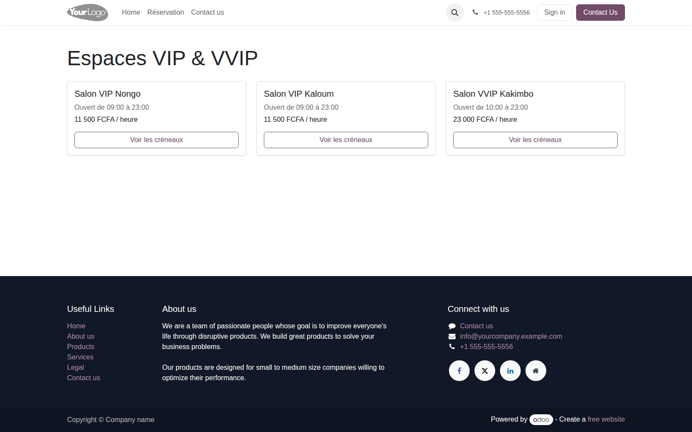


### 3. Voir les créneaux libres

| | |
|---|---|
| **Attendu** | La grille du jour montre les créneaux encore disponibles. |
| **Constaté** | La grille du jour montre les créneaux encore disponibles. |
| **Verdict** | ✅ Conforme |


### 4. Choisir un créneau et se présenter

| | |
|---|---|
| **Attendu** | Un créneau est coché et les coordonnées sont saisies ; le formulaire est prêt à partir. |
| **Constaté** | Créneau sélectionné, coordonnées renseignées. |
| **Verdict** | ✅ Conforme |

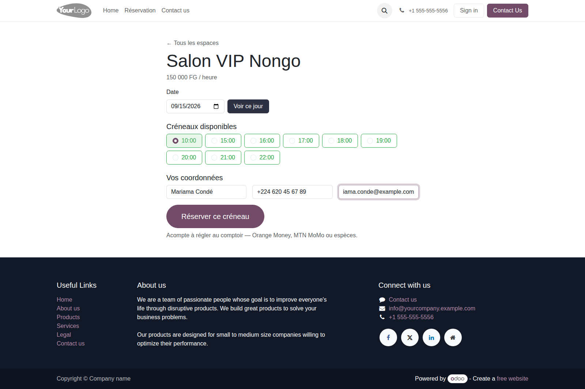


### 5. Valider la réservation

| | |
|---|---|
| **Attendu** | La page de remerciement affiche la référence de la réservation, preuve de son enregistrement côté back-office. |
| **Constaté** | La réservation est confirmée et sa référence s'affiche. |
| **Verdict** | ✅ Conforme |

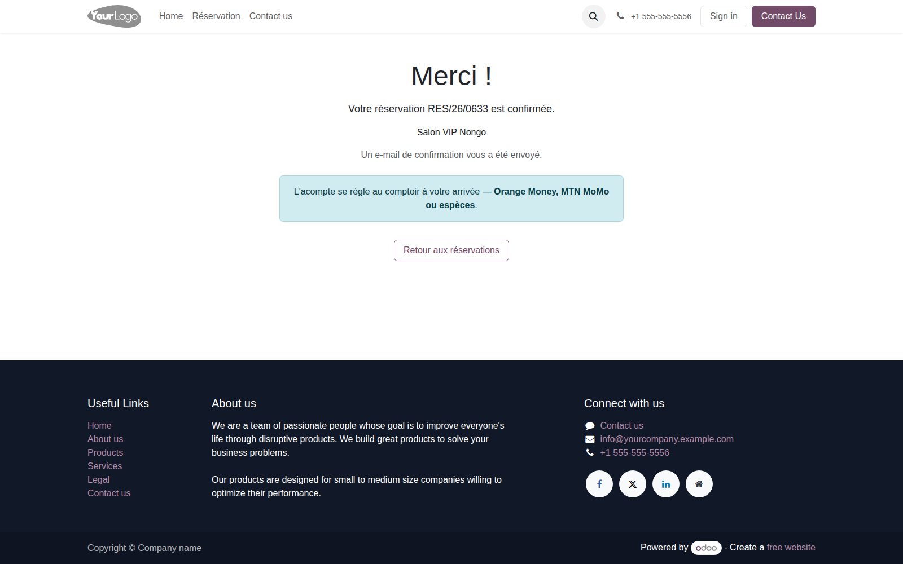


### 6. Demander un séjour

| | |
|---|---|
| **Attendu** | Le formulaire de demande de chambre s'affiche (dates, occupation, coordonnées). |
| **Constaté** | Le formulaire de demande de séjour s'affiche. |
| **Verdict** | ✅ Conforme |

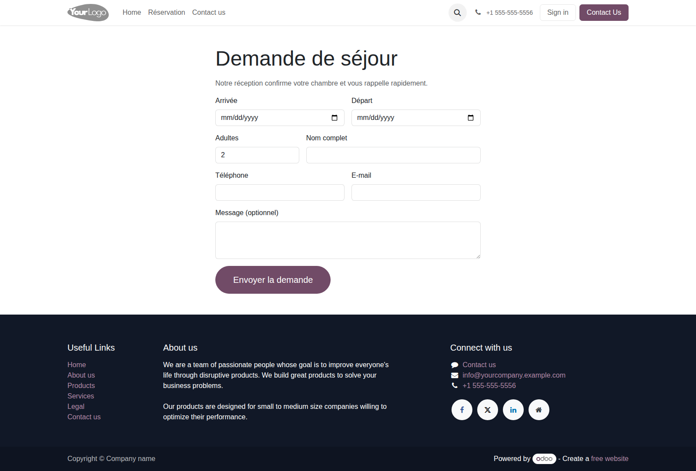


---

## 6. Stock, ruptures et réapprovisionnement

> **Poste :** Magasin (Moussa Camara)
> **Objectif :** Repérer les ruptures et les articles sous seuil, et consulter la valorisation du stock.
> **Verdict global :** ✅ Conforme


### 1. Ouvrir le tableau de bord Stock

| | |
|---|---|
| **Attendu** | Valorisation, nombre de références, ruptures et couverture moyenne sont affichés. |
| **Constaté** | Le tableau de bord Stock s'affiche avec ses indicateurs. |
| **Verdict** | ✅ Conforme |

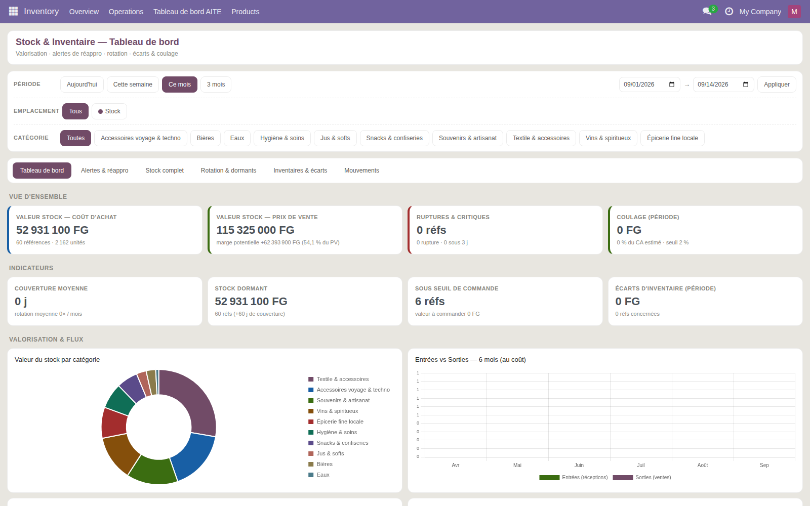


### 2. Tenter d'ouvrir les ardoises clients

| | |
|---|---|
| **Attendu** | Le profil Magasin n'a pas de droits sur le crédit clients : Odoo doit afficher un refus nommant le modèle concerné. |
| **Constaté** | L'accès au crédit clients est refusé, avec le motif affiché. |
| **Verdict** | ✅ Conforme |

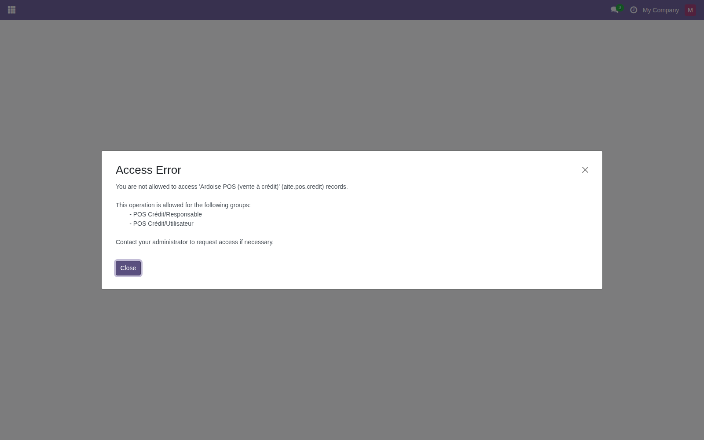


---

_Cahier produit automatiquement par `tests_uat/build_guide.py` à partir de l'exécution réelle des scénarios._
